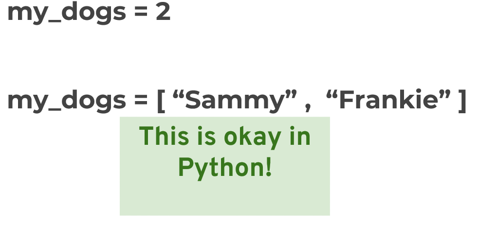

# Data Types:

## 03: Identifiers:

- The only allowed characters to write identifier in python are,
    - Alphabets, these can be either lower case or upper case.
    - Digits (0 to 9)
    - Underscore symbol (_)
- If we are using any other symbol like ( $, !, -, etc) then we will get syntax error.

### 1. class:
- class names should start with upper case and remainingletters are in lower case.
- If name having multiple words, then every inner word should start with upper case letter.
- Example: StudentInfo
- Info: This rule is applicable for classes created by users only; the in-built class names used all are in lowercase.

### 2. package, 3. module , 4. variable, 5. function, 6. method:
- Names should be in lower case.
- If name having multiple words, then separating words with underscore (_) is good practice.
- Example: one_two

### 7. Non-public instance variables:
- Non-public instance variables should begin with underscore (_), we can say private data
- Example: _one

### 8. constants:
- Constants names should be written in all capital letters.
- If name having multiple words, then separating words with underscore (_) is good practice.
- Example: ONE_TWO

### 9. Non-accessible entities:
- Some variables and functions not accessible outside.
- Those variables and function names started with two underscores symbols.
- Example: __init__(self)

---

## 04: Variables:
### Rules for variable names
- variable names follows Identifier rules
- It's considered best practice (PEP8) that names are lowercase.
- Avoid using words that have special meaning in Python like "list" and "str"
- Python uses Dynamic Typing, This means you can reassign variables to different data types.
- This makes Python very flexible in assigning data types, this is different than other languages that are “Statically-Typed”
- Dynamic typing

---

## Data Types:

---