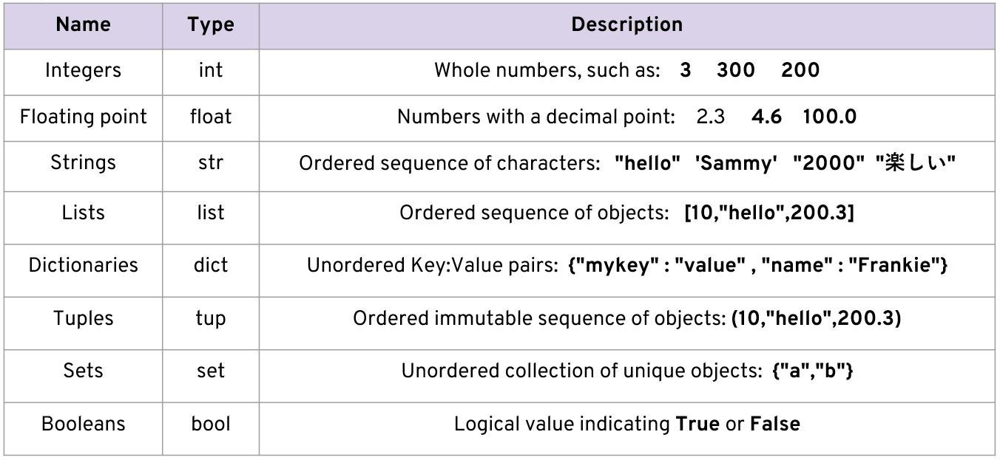

# Python Basics

## Data Types:




---

## Variables:

#### Rules for variable names
- Names can not start with a number.
- There can be no spaces in the name, use _ instead.
- Can't use any of these symbols :'",<>/?|\()!@#$%^&*~-+
- It's considered best practice (PEP8) that names are lowercase.
- Avoid using words that have special meaning in Python like "list" and "str"
- Python uses Dynamic Typing, This means you can reassign variables to different data types.
- This makes Python very flexible in assigning data types, this is different than other languages that are “Statically-Typed”


---


## Strings:

- Strings are sequences of characters, using the syntax of either single  quotes or double quotes:

```python
'hello'
"Hello"
" I don't do that "

```

- Because strings are **ordered sequences** it means we can using **indexing** and **slicing** to grab sub-sections of the string.
- Indexing notation uses [ ] notation after the string (or variable assigned the string).
- Indexing allows you to grab a single character from the string

````
These actions use [ ] square brackets and a number index to indicate positions of what you wish to grab.
Character :     h     e     l    l    o
    Index :     0     1     2    3    4
Reverse Index:  0    -4    -3   -2    -1

````

#### Slicing:

- Slicing allows you to grab a subsection of multiple characters, a “slice” of the string.
- This has the following syntax:
- `[start:stop:step]`
- **start** is a numerical index for the slice start
- **stop** is the index you will go up to (but not include)
- **step** is the size of the “jump” you take


````python
index0 = "Hello"[0]
indexNeg = "World"[-2]
print(index0)
print(type(index0))
print(indexNeg)

greet = "Hey There!"

print("greet", greet)
print(type(greet))
print(greet[4])

print("greet= ", greet)
print("slice: [0:3] ", greet[0:3]) # 0,1,2
print("slice: [0:7] ", greet[0:7]) # 0,1,2,3,4,5,6
print("slice: [0:7:2] ", greet[0:7:2]) # 0,2,4,6
````


#### Strings Methods 

````python
# Properties & Methods of Strings
# Strings are immutable
print("greet.upper(): ", greet.upper())  # convert to uppercase
print("greet.lower(): ", greet.lower())  # convert to lowercase
print("greet", greet)  # original string remains unchanged

# split string into list
print("greet.split(): ", greet.split())  # default split by space
print("greet.split(e): ", greet.split('e'))  # split by 'e'


````

#### Strings Formatting:

````python

# formatting
name = "John"
age = 30
print("My name is {} and I am {} years old".format(name, age))
print("My name is {1} and I am {0} years old".format(age, name))  # positional arguments
print("My name is {n} and I am {a} years old".format(n=name, a=age))  # keyword arguments
print("My name is {n} and I am {a} years old".format(a=age, n=name))  # order doesn't matter
print("My name is {:s} and I am {:d} years old".format(name, age))  # type specifiers
print("My name is {:10s} and I am {:5d} years old".format(name, age))  # width

print(f"My name is {name} and I am {age} years old")  # f-string (Python 3.6+)
print("My name is %s and I am %d years old" % (name, age))  # old style
# %s - string, %d - integer, %f - float

````


