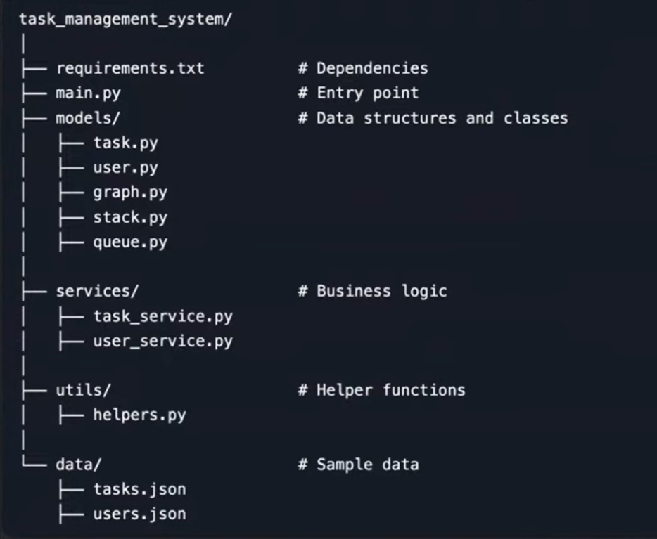

# Task Management System:

This project is a Task Management System that demonstrates practical usage of Python Data Structures in modular, production-like format.

## Functionalities:

- Stores tasks using a list
- Stores users using a dictionary
- Manages tasks assignment using a queue
- Tracks the task history using a stack
- Handles task dependencies using a graph
- 

